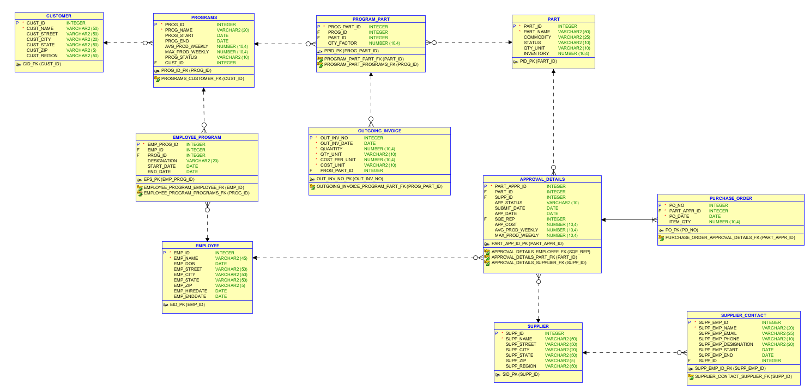

# Supply Chain Database

## INFO6210 Project

Harshit Raj

Monica

## ERD

### ToDo

- [x] Admin User creation
- [x] Create Tables
- [ ] Insert test data
- [ ] Create views
- [ ] Create reports
- [ ] Create users with limited access
- [ ] create test script to verify user control
- [ ] Fin.

## Retrival

### Customer Table

- [X] Select all Customers
- [X] Select Customers from a region

### Programs

- [X] See all programs
- [X] See active programs
- [x] See programs by status
- [X] See programs by year

### Employee

- [X] Select All employee
- [X] Select Avtive employee
- [X] Select not active employee
- [X] Select employee by year

### Part

- [X] Select all parts
- [X] Select part by comodity
- [ ] Select part by partStatus
- [ ] Select Part by comodity and PartStatus

### Supplier

- [ ] Select all Supplier
- [ ] Select Supplier from region

### Supplier_Contact

- [ ] Select all Supplier contact
- [ ] 

